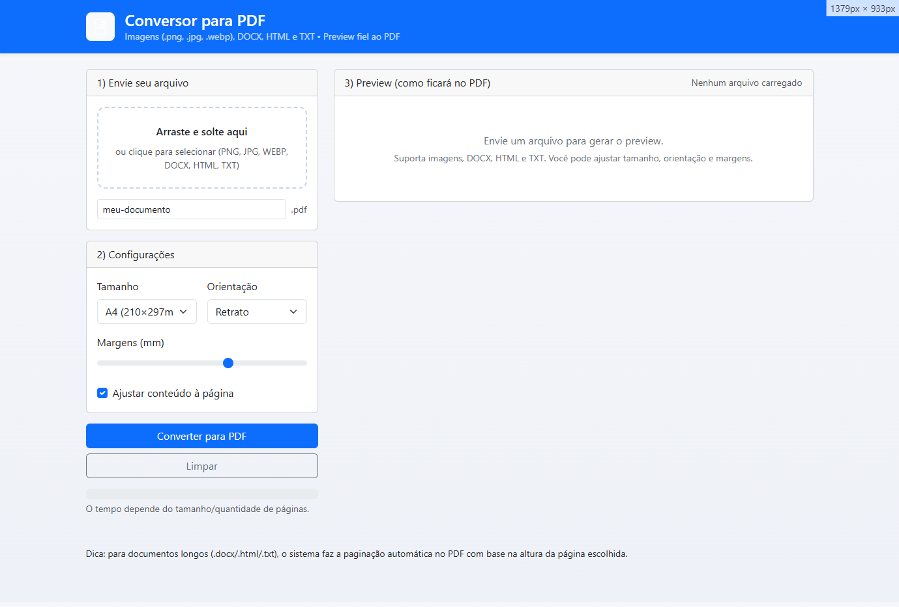

# Conversor de Imagem/Documento para PDF com Preview

Este é um projeto **HTML, CSS e JavaScript** com **Bootstrap** que permite **converter imagens e documentos** para **PDF** diretamente no navegador, com **visualização (preview) de como ficará antes da conversão**.

## 📌 Funcionalidades

- **Upload de Arquivos**:
  - Imagens (`.jpg`, `.jpeg`, `.png`, `.gif`)
  - Documentos de texto (`.txt`, `.html`)
- **Preview em Tela**:
  - Mostra como ficará o arquivo no PDF antes da conversão.
  - Ajuste automático para formato **A4**.
- **Conversão para PDF**:
  - Geração de PDF no **lado do cliente** (sem enviar arquivos para o servidor).
  - Usa as bibliotecas [html2canvas](https://html2canvas.hertzen.com/) e [jsPDF](https://github.com/parallax/jsPDF).
- **Interface com Bootstrap 5**:
  - Layout responsivo e moderno.
  - Botões e componentes estilizados.
- **Compatibilidade com Desktop e Mobile**.

## 🛠 Tecnologias Utilizadas

- **HTML5**
- **CSS3**
- **JavaScript (ES6)**
- **Bootstrap 5**
- **[html2canvas](https://html2canvas.hertzen.com/)**
- **[jsPDF](https://github.com/parallax/jsPDF)**

## 🚀 Como Usar

1. **Baixe ou clone o repositório**:
   ```bash
   git clone https://github.com/seu-usuario/conversor-imagem-doc-pdf.git
   ```

2. **Abra o arquivo `index.html` no navegador**:
   - Não precisa de servidor — é 100% client-side.

3. **Selecione um arquivo** clicando no botão de upload.

4. **Veja o preview** do arquivo no formato PDF.

5. **Clique em "Converter para PDF"** para baixar o arquivo convertido.

## 📂 Estrutura de Pastas

```
conversor-pdf/
│
├── index.html      # Página principal com Bootstrap + JS
├── README.md       # Documentação do projeto
├── /assets         # (Opcional) Pasta para imagens e ícones
```

## 📸 Preview da Interface



## 📜 Licença

Este projeto está sob a licença **MIT** — você pode usá-lo, modificá-lo e distribuí-lo livremente.
